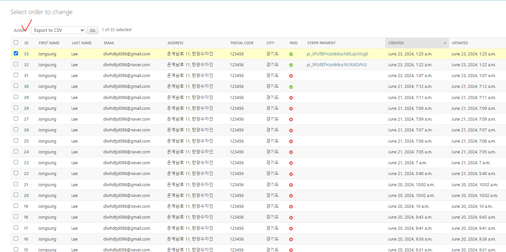

# 주문을 CSV 파일로 내보내기
- 데이터를 다른 시스템으로 가져올 수 있도록 파일로 내보내야 하는 경우 CSV 형식으로 보내도록 한다.

## 코드

```python
# admin.py


def export_to_csv(modeladmin, request, queryset):
    opts = modeladmin.model._meta
    content_disposition = f"attachment; filename={opts.verbose_name}.csv"
    response = HttpResponse(content_type="text/csv")
    response["Content-Disposition"] = content_disposition
    writer = csv.writer(response)
    fields = [
        field
        for field in opts.get_fields()
        if not field.many_to_many and not field.one_to_many
    ]
    # 헤더 정보로 첫 행 작성
    writer.writerow([field.verbose_name for field in fields])
    # 각 행의 데이터 작성
    for obj in queryset:
        data_row = []
        for field in fields:
            value = getattr(obj, field.name)
            if isinstance(value, datetime.datetime):
                value = value.strftime("%Y/%m/%d")
            data_row.append(value)
        writer.writerow(data_row)
    return response


export_to_csv.short_description = "Export to CSV"  # 관리 사이트의 작업(Action) 드롭다운 엘리먼트에 있는 작업의 표시 이름을 커스터마이징 한다.


@admin.register(Order)
class OrderAdmin(admin.ModelAdmin):
    ...
    actions = [export_to_csv]
```

- 결과


- 참고: [how to outputting csv](https://docs.djangoproject.com/en/5.0/howto/outputting-csv/)