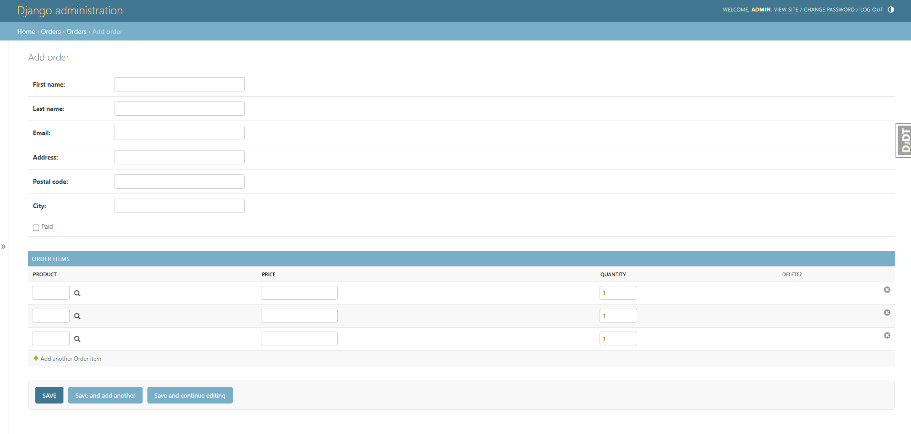

# 고객 주문 등록하기
- 주문에는 고객과 고객이 구매하는 제품 정보가 포함된다.

## 관리 사이트에 주문 모델 추가하기

- 주문 아이템을 주문 하위 인라인으로 포함시키기 위해 `TabularInline`을 활용하여 OrderAdmin에 포함시킨다.

```python
from django.contrib import admin

from orders.models import OrderItem, Order


class OrderItemInline(admin.TabularInline):
    model = OrderItem
    raw_id_fields = ["product"]


@admin.register(Order)
class OrderAdmin(admin.ModelAdmin):
    list_display = [
        "id",
        "first_name",
        "last_name",
        "email",
        "address",
        "postal_code",
        "city",
        "paid",
        "created",
        "updated",
    ]
    list_filter = ["paid", "created", "updated"]
    inlines = [OrderItemInline]


```

- 결과
 