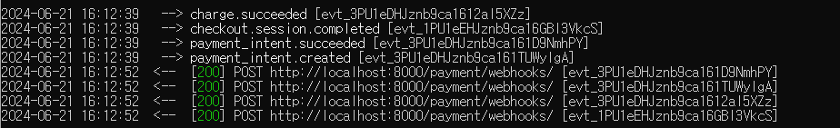

# 결제하기

- 사용자가 신용카드로 결제할 수 있도록 결제 게이트웨이를 사이트에 통합하는 방법을 알아보자

## Goal

- 프로젝트에 stripe 결제 게이트웨이 통합하기
- Stripe로 신용카드 결제 처리하기
- 결제 알림 처리하기
- 주문을 CSV 파일로 내보내기
- 관리 사이트에 대한 커스텀 뷰 마늘기
- 동적으로 PDF 인보이스 생성하기

## 전자결제 게이트웨이 통합하기

- 결제 게이트웨이인 Stripe를 사용하여 결제를 처리하는 방법을 알아보자

### Stripe 계정 만들기

- [Stripe](https://stripe.com)에 가입하고 계정을 만든다

### Stripe 세팅하기

- 설치

```bash
pip install stripe
```

- settings.py에 stripe api key 추가

```python
# settings.py
import os

STRIPE_PUBLISHABLE_KEY = os.environ.get("STRIPE_PUBLISHABLE_KEY")
STRIPE_SECRET_KEY = os.environ.get("STRIPE_SECRET_KEY")
```

### 결제 프로세스 구축하기

1. 앱 생성
2. stripe checkout 통합하기
    - payment_process: stripe 결제 세션을 생성하고 클라이언트를 Stirpe에서 호스팅하는 결제 폼으로 리디렉션 한다.
    - payment_completed: 결제 성공 메시지를 표시
    - payment_canceled: 결제 취소 메시지를 표시

### 결제 처리 흐름

1. 주문이 생성되면 사용자는 `payment_process`뷰로 리디렉션 된다. 주문 요약과 결제를 진행할 수 있는 버튼이 사용자에게 표시된다.
2. 사용자가 결제를 진행하면 Stripe 결제 세션이 생성된다.    
   결제 세션에는 사용자가 구매할 항목의 목록, 결제 성공 후 사용자를 리디렉션할 URL, 결제가 취소된 경우 사용자를 리디렉션할 URL이 포함된다.
3. 이 보기는 사용자를 Stripe 호스팅 결제 페이지로 리디렉션한다. 이 페이지에는 결제폼이 포함된다. 고객이 신용카드 세부 정보를 입력하고 폼을 제출한다.
4. Stripe에서 결제를 처리하고 클라이언트를 payment_completed 뷰로 리디렉션 한다.   
   고객이 결제를 완료하지 않으면 Stripe는 대신 고객을 pament_canceled 뷰로 리디렉션 한다.

### 코드 살펴보기

- 결제 프로세스

```python
# views.py

import stripe
from django.shortcuts import get_object_or_404, redirect, render

from orders.models import Order


def payment_process(request):
    order_id = request.session.get("order_id", None)
    order = get_object_or_404(Order, id=order_id)
    if request.method == "POST":
        success_url = request.build_absolute_uri("payment:completed")
        cancel_url = request.build_absolute_uri("payment:canceled")
        # Stripe 결제 세션 데이터
        session_data = {
            "mode": "payment",  # 결제 세션의 모드이다. 일회성 결제를 뜻함. 구독 같은 반복적인 결제는 `recurring payment`로 설정
            "client_reference_id": order.id,
            # 결제의 고유한 래퍼런스이다. 이 정보를 사용해서 Stripe 결제 세션에 전달한다. 주문 ID를 전달하면 Stripe 결제를 시스템에서 주문에 연결하고, Stripe로부터 결제 알림을 수신해서 주문을 결제된 것으로 표시할 수 있다.
            "success_url": success_url,
            # 결제가 성공한 경우 Stripe에서 사용자를 리디렉션할 URL이다. request.build_absolute_uri() 함수를 사용해서 절대 URI을 생성한다.
            "cancel_url": cancel_url,
            "line_items": [],  # 나중에 구매할 주문 항목들로 채운다.
        }
        # stripe 결제 세션 생성
        session = stripe.checkout.Session.create(**session_data)
        # stripe 결제 양식으로 리디렉션
        return redirect(session.url, code=303)
    else:
        return render(request, "payment/process.html", locals())  # locals()로 지역변수를 context 로 넘김
```

- 결제 테스트

| 결과          | 테스트 카드 번호           | cvc   | 카드 유효기간   |
|-------------|---------------------|-------|-----------|
| 결제 성공       | 4242 4242 4242 4242 | 아무 숫자 | 미래의 아무 날짜 |
| 결제 실패       | 4000 0000 0000 0002 | 아무 숫자 | 미래의 아무 날짜 |
| #D 보안 인증 필요 | 4000 0025 0000 3155 | 아무 숫자 | 미래의 아무 날짜 |


## 웹후크를 사용한 결제 알림 받기
- stripe는 웹후크를 사용해서 실시간 이벤트를 앱에 푸쉬할 수 있다.
- 콜백이라고도 하는 웹후크는 요청 중심의 API가 아닌 이벤트 중심의 API로 생각할 수 있다.
- 새로운 결제가 완료되었는지 확인하기 위해 Stripe API를 폴링하는 대신 Stripe가 앱의 URL로 HTTP 요청을 전송해서 결제 성공 여부를 실시간으로 알릴 수 있다.

### 웹후크 엔드 포인트 만들기

- dashboard에서 웹후크 메뉴로 들어간다.
- `Test in a local environment` 버튼을 클릭한다.
- `endpoint_secret`를 복사해서 settings.py에 추가한다.

```python
# payment.webhooks.py


import stripe
from django.conf import settings
from django.http import HttpResponse
from django.views.decorators.csrf import csrf_exempt

from orders.models import Order


@csrf_exempt  # 모든 POST 요청에 기본적으로 수행되는 CSRF 유효성 검사를 장고가 수행하지 못하도록 하는데 사용한다.
def stripe_webhook(request):
    payload = request.body
    sig_header = request.META["HTTP_STRIPE_SIGNATURE"]
    event = None
    try:
        event = stripe.Webhook.construct_event(
            payload, sig_header, settings.STRIPE_WEBHOOK_SECRET
        )
    except ValueError:
        # 잘못된 페이로드
        return HttpResponse(status=400)
    except stripe.error.SignatureVerificationError:
        # 잘못된 서명
        return HttpResponse(status=400)
    if event.type == "checkout.session.completed":
        session = event.data.object
        if session.mode == "payment" and session.payment_status == "paid":
            try:
                order = Order.objects.get(id=session.client_reference_id)
            except Order.DoesNotExist:
                return HttpResponse(status=404)
            # 주문을 결제 완료로 표시
            order.paid = True
            order.save()
    return HttpResponse(status=200)
```

### 웹후크 알림 테스트하기

1. [stripe cli 설치](https://docs.stripe.com/stripe-cli)
2. shell에서 `stripe login` 입력
3. 브라우저 창이 떴다면 `stripe listen --forward-to localhost:8000/payment/webhooks/` 입력
4. `STRIPE_WEBHOOK_SECRET`괴 cmd창에 표시된 키가 같은지 확인
5. https://dashboard.stripe.com/test/webhooks 로 접속해서 local listeners에 로컬 PC가 등록되었는지 확인하기
6. 결제를 완료하면 stripe cli에서 이벤트를 확인할 수 있다.
   
- NOTE
   - 프로덕션 환경에서는 Stripe CLI가 필요하지 않다. 다만 호스팅된 앱의 URL을 사용해서 웹후크 앤드포인트를 추가하면 된다.

## Orders 앰에서 Stripe 결제 참조하기

- 각 stripe 결제에는 고유의 식별자가 있다. 해당 식별자를 통해 각 주문을 Stripe 결제와 연결할 수 있다.

